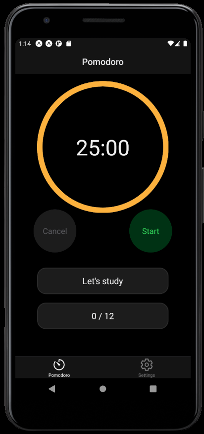
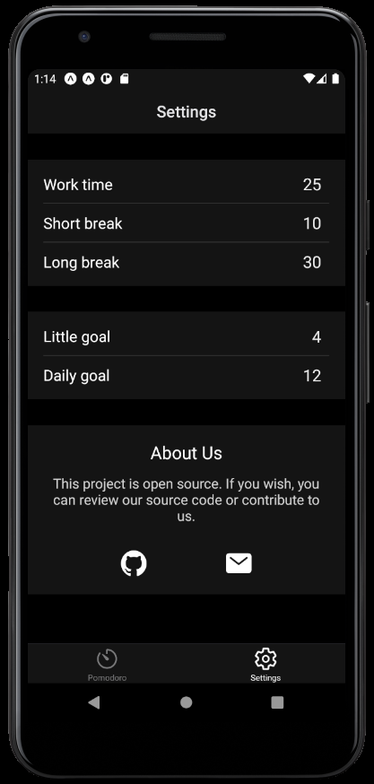

# Pomodoro App with React Native
The reason this project was developed is that I cannot find a nice pomodoro app that I can personally use on Google Play and the App Store.
<br/> 

<div>
     
     
</div>

## Installation
First, install dependencies.
```
npm install
```
<br/>

Second, install expo-cli globally.
```
sudo npm install -g expo-cli
```
<br/>

Third, run the application.
```
expo start
```

## Useful links
Google Play (will be added)
